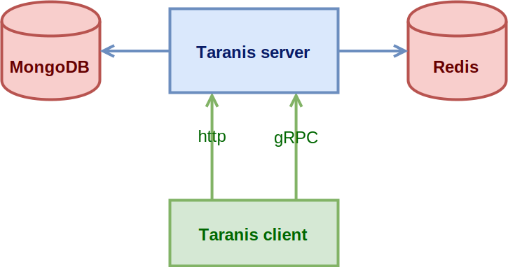

= Taranis

Taranis is a similarity search engine built around https://github.com/facebookresearch/faiss[Faiss] library.
It allows you to find the most similar vectors (a common mathematical and simplified representation of an image or a sound) of a query vector among hundreds of millions, or billions if you have enough RAM.

== Why ?

Many computer scientists are now able to use machine learning frameworks to classify images without even having to understand how it works. It is very easy to obtain a probability of belonging to a class.
In a production environment, regularly adding images or classes causes a bottleneck since you must constantly re-learn your model. One solution is to use a non-evolving model that simply produces an N-dimensional vector for each input image. These vectors can then be compressed, indexed and/or searched by similarity with an external and incremental system.

== What is it ?

Taranis is similarity search engine (Think Elasticsearch, but for vectors, not text documents). Taranis is in fact just a wrapper around the https://github.com/facebookresearch/faiss[Faiss library]. It aims at providing what is missing in such a scientific library:

* Data persitency: reliable storage of raw and compressed vectors (Faiss stores the data in RAM, and can persist to disk on demand, but the writing is not incremental).
* Web services: Taranis provides a gRPC server, and some rest API endpoints for management/monitoring.
* Packaging in a ready-to-run Docker image.

[.center.text-center]
[#archi]
.Global Architecture


== Quick Start

.Start the Taranis server with dependencies (Mongo + Redis)
```
docker-compose up
```


== Getting Started

These instructions will get you a copy of the project up and running on your local machine for development and testing purposes. See deployment for notes on how to deploy the project on a live system.

=== Prerequisites

==== Databases

* MongoDB 4.0+ (for storing databases and indices informations, and raw features)
* Redis 5.0+ (for storing Faiss indices and encoded vectors, inverted lists, etc.)

==== C$$++$$ (11+) dependencies

* cmake 3.7+
* openblas
* tacopie 3.2.0: https://github.com/Cylix/tacopie[https://github.com/Cylix/tacopie]
* cpp_redis 4.3.1: https://github.com/cpp-redis/cpp_redis[https://github.com/cpp-redis/cpp_redis]
* faiss 1.5.3: https://github.com/facebookresearch/faiss[https://github.com/facebookresearch/faiss]
* pybind11 2.2.4: https://github.com/pybind/pybind11[https://github.com/pybind/pybind11]
* fmtlib 5.3.0: https://github.com/fmtlib/fmt[https://github.com/fmtlib/fmt]

==== Python (3.7) dependencies

See list in requirements.txt

.install dependencies with:
```
pip install -r requirements.txt
```

=== Installing

.from sources:
```
mkdir build
cd build
cmake ..
make
```

.in a Docker image:
```
docker build -t pletessier/taranis .
```

== Deployment

```
docker-compose up -d
```

A default configuration file is provided inside the the Docker image.
There are 4 complementary ways to configure Taranis:

* One or more configuration files (yaml|tomljson|ini|xml) provided by the `--config-file /my/config/file/path` command line arg.
* One or more configuration directories provided with the `--config-path /my/config/directory` command line arg. Example: providing the path `/run/secrets`, Taranis will read every files in all subdirectories of `/run/secrets` and associate a key (the subpath) to a value (file content). If there is a file `/run/secrets/db/redis/password` containing the text `notagoodpassword`, the configuration will be: `db.redis.password=notagoodpassword`
* Every environment variables starting with `$$TARANIS__$$` will be parsed. For instance, `$$TARANIS__DB__REDIS__HOST$$=my-redis-host` is equivalent to `db.redis.host=my-redis-host`.
* Every additional command lines provided with the arg `--additional-config` or `-C`, such as `-C db.redis.host=my-redis-host`.

== Tests

NOTE: Explain how to run the Taranis client code with a 1M vectors dataset.

== Author

I am **Pierre Letessier**, R&D engineer. Taranis is a personal project developed only in my free time, so please be indulgent !

== Contributing

Feedbacks, tests, benchmarks, issues and pull requests are welcome. For pull requests, please fork and create a new branch before to submit it.

== License

This project is licensed under the BSD 3 License - see the license[LICENSE.md] file for details

== Acknowledgments

Thanks to Matthijs Douze for answering my questions about Faiss.
